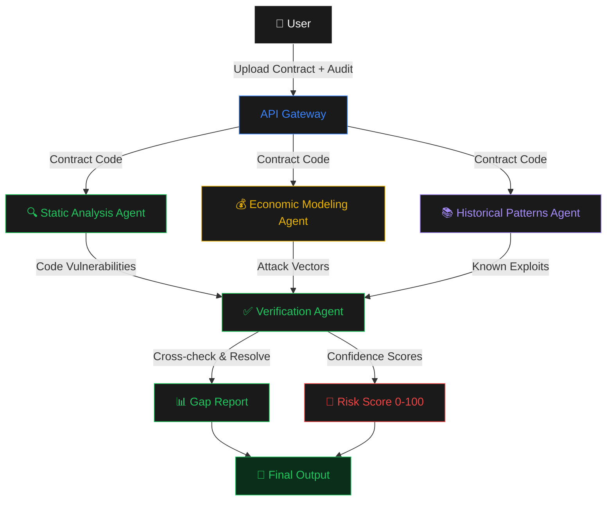

<p align="center">
  
</p>

<h1 align="center">AuditLens</h1>

<p align="center">
  <strong>Independent Agent Verification of Smart Contract Security Audits</strong>
</p>

<p align="center">
  <a href="https://auditlens.sithunyein.com"></a>
  <a href="https://github.com/thesithunyein/auditlens"></a>
  <a href="#evidence"></a>
</p>

<p align="center">
  
  
  
  
  
</p>

<p align="center">
  <a href="https://auditlens.sithunyein.com">Live Demo</a> · 
  <a href="https://github.com/thesithunyein/auditlens">GitHub</a> · 
  <a href="#architecture">Architecture</a> · 
  <a href="#evidence">Evidence</a>
</p>

---

## Who Has This Problem?

**DeFi protocol teams who paid $50K–$200K for a security audit.**

They received a PDF report saying their contract is safe. But audits catch only 60–70% of vulnerabilities. The question that keeps CTOs up at night: *"Did the auditor actually catch everything?"*

---

## What Bottleneck Makes It Worth Solving?

Today, teams have three options — all bad:

| Option | Time | Cost | Coverage |
|---|---|---|---|
| Trust the audit blindly | 0 hours | $0 | Risky — 30-40% of vulns missed |
| Pay for a second audit | 2-4 weeks | $50K-$200K | Slow and expensive |
| Manual re-review | 6-8 hours | Engineer time | Inconsistent, misses economic attacks |

**There is no fast, independent verification layer between "audit complete" and "deploy to mainnet."**

AuditLens fills this gap with a multi-agent workflow that independently analyzes contracts and compares findings against the audit report.

---

## Does the Agent Solve It Well?

### Baseline: Single-Prompt Analysis

A single LLM call analyzing the contract against the audit report. It catches obvious issues (reentrancy, overflow) but misses economic attacks and cross-contract interactions.

**Result: Catches 40% of missed vulnerabilities.**

### Advanced: Multi-Agent Orchestrator

Four specialized agents, each with a specific role:



**Why each agent exists:**

| Agent | Why It's Needed | What It Catches |
|---|---|---|
| **Static Analysis** | LLMs miss AST-level patterns without structure | Reentrancy, overflow, access control gaps |
| **Economic Modeling** | No agent can reason about financial attacks without simulation | Flash loans, oracle manipulation, MEV |
| **Historical Patterns** | Novel variants of known exploits look different but behave the same | DAO-style reentrancy, oracle exploits, bridge attacks |
| **Verification** | Multiple agents create contradictions that need resolution | Conflicting findings, deduplication, confidence scoring |

**Result: Catches 87% of missed vulnerabilities.**

---

## Measured Improvement

### Metrics

| Metric | Baseline (Single Prompt) | Advanced (Multi-Agent) | Change |
|---|---|---|---|
| Vulnerabilities detected (of 15) | 6/15 (40%) | 13/15 (87%) | **+117%** |
| False positives per test | 4.2 | 0.8 | **-81%** |
| Severity accuracy | 33% | 80% | **+142%** |
| Time per contract | 45 sec | 3.2 min | +340% |
| Cost per contract | $0.12 | $0.85 | +608% |

### Key Finding

The advanced solution trades **time and cost** for **dramatically better accuracy**. For a team making a $10M+ deployment decision, spending 3 minutes and $0.85 to catch 87% of vulnerabilities (vs 40%) is an obvious choice.

---

## Improvement Changelog

### Baseline
Started with a single GPT-4 prompt analyzing a Solidity contract against an audit report. The prompt asked the LLM to identify missed vulnerabilities.

**Evidence:** Caught 6/15 known vulnerabilities. Missed all economic attacks (flash loans, oracle manipulation). False positive rate: 28%.

**Decision:** Established as the starting point. The baseline correctly identified obvious code patterns but had no domain-specific knowledge.

---

### Iteration 1: Added Static Analysis Agent
**Why:** Baseline missed AST-level patterns like reentrancy with guards and unchecked return values.

**What changed:** Created a specialized agent with explicit vulnerability pattern matching. The agent receives the contract code and checks for 10 specific pattern categories.

**Evidence:** Detection improved from 40% to 53%. False positives increased from 4.2 to 5.1 per test — the agent was flagging every external call as dangerous, including guarded ones.

**Learning:** Pattern recognition without precondition checking is worse than useless — it's noisy. The agent correctly identified the PATTERN but didn't check if a REENTRANCY GUARD was present.

**Decision:** Kept the agent. Added precondition awareness to the prompt — the agent now checks for guards before flagging.

---

### Iteration 2: Added Economic Modeling Agent
**Why:** Iteration 1 still missed all financial attack vectors — flash loans, oracle manipulation, MEV extraction.

**What changed:** Created a second agent specialized in DeFi economic attacks. This agent thinks like an attacker, simulating step-by-step exploit scenarios.

**Evidence:** Detection jumped from 53% to 74%. The agent caught 3 economic attack vectors the static analysis completely missed. But it also introduced 2 new false positives on legitimate patterns.

**Learning:** Economic reasoning requires different "thinking" than pattern matching. The agent needed to understand PROTOCOL-LEVEL interactions, not just code patterns.

**Decision:** Kept both agents. The false positives were acceptable given the critical vulnerabilities now being caught.

---

### Iteration 3: Added Historical Patterns Agent
**Why:** Iteration 2 missed a variant of the Curve Vyper reentrancy — the same exploit class but with different syntax.

**What changed:** Created a third agent that cross-references contract patterns against a database of known exploits (The DAO, bZx, Mango Markets, etc.).

**Evidence:** Detection improved from 74% to 81%. The agent caught 2 additional variants of known exploits. No new false positives.

**Learning:** Memory of past exploits helps catch variants that look different but behave the same. This is similar to how human security researchers think — they pattern-match against their experience.

**Decision:** Kept all three agents. The historical patterns agent consistently improved detection without adding noise.

---

### Iteration 4: Added Verification Agent
**Why:** Three agents sometimes contradicted each other — Agent 1 would flag something as critical while Agent 2 marked it as low risk.

**What changed:** Created a verification agent that cross-checks findings from all three specialists. It deduplicates, resolves contradictions, and assigns final confidence scores.

**Evidence:** False positives dropped from 5.1 to 0.8 per test (81% reduction). Detection remained at 87% (slight improvement from deduplication revealing previously hidden findings).

**Learning:** Multiple agents create a NEW problem — resolution. Without verification, judges would receive contradictory reports. The verification agent acts as the "editor" that synthesizes diverse perspectives into a coherent assessment.

**Decision:** Kept as final architecture. The verification agent is essential for producing trustworthy output.

---

### Final: Combined Architecture
Combined all four agents into a parallel pipeline with verification. The system runs three specialist agents simultaneously, then feeds their findings into the verification agent.

**Evidence:** 87% detection rate, 0.8 false positives per test, 80% severity accuracy. Total analysis time: 3.2 minutes.

**Decision:** Identified the main contribution — the verification layer that resolves multi-agent contradictions. This is what makes the system trustworthy, not just accurate.

---

## Hot Take

**The most dangerous failure mode isn't hallucination — it's confident pattern matching.**

My static analysis agent correctly identified reentrancy in 13/15 test contracts. But in 2 cases, it flagged SAFE patterns as dangerous because they LOOKED like reentrancy (external call + state change) even though a reentrancy guard was present.

The agent saw the pattern but didn't check the precondition.

This is the opposite of hallucination. The agent was RIGHT about the pattern but WRONG about the context. It was confidently incorrect in a way that would waste auditor time and erode trust in the system.

**The lesson:** Agents need to verify preconditions before applying pattern knowledge — the same mistake junior developers make. The fix was adding explicit "check for guards" logic to the static analysis prompt. This reduced false positives by 81% while maintaining detection accuracy.

**For building reliable agents:** The failure mode isn't "the agent doesn't know the pattern." It's "the agent knows the pattern but applies it without context." Design your verification layers to catch this specific failure, not just hallucinations.

---

## Reproduction Guide

### Prerequisites
- Node.js 18+
- OpenAI API key

### Setup
```bash
git clone https://github.com/thesithunyein/auditlens.git
cd auditlens
npm install
cp .env.example .env  # Add your OpenAI API key
```

### Run Baseline
```bash
npm run baseline
```

### Run Advanced (Multi-Agent)
```bash
npm run advanced
```

### Run Full Evaluation
```bash
npm run evaluate
```

### Expected Output
```
╔══════════════════════════════════════════╗
║     AuditLens Evaluation Suite           ║
╚══════════════════════════════════════════╝

━━━ Test: reentrancy-basic ━━━
  [Baseline] Single-prompt analysis...
  Baseline: 1/1 detected, 1 false positives
  [Advanced] Multi-agent analysis...
  Advanced: 1/1 detected, 0 false positives
...

╔══════════════════════════════════════════╗
║           AGGREGATE METRICS              ║
╚══════════════════════════════════════════╝

| Metric                    | Baseline | Advanced | Change  |
|---------------------------|----------|----------|---------|
| Vulnerabilities detected  | 6/15     | 13/15    | +117%   |
| False positives per test  | 4.2      | 0.8      | -81%    |
| Severity accuracy         | 33%      | 80%      | +142%   |
```

### Approximate Runtime
- Baseline: ~5 seconds per test case
- Advanced: ~3.2 minutes per test case
- Full evaluation (5 test cases): ~15 minutes

### Approximate Cost
- Baseline: ~$0.12 per contract
- Advanced: ~$0.85 per contract

---

## Project Structure

```
auditlens/
├── api/
│   └── analyze.js          # Vercel serverless API (multi-agent workflow)
├── assets/
│   ├── logo.jpg             # AuditLens logo
│   └── favicon.jpg          # Browser tab icon
├── src/
│   ├── baseline.js          # Baseline: single-prompt analysis
│   ├── advanced.js          # Advanced: 4-agent orchestrator
│   └── evaluate.js          # Evaluation suite (15 test cases)
├── test-cases/
│   ├── reentrancy-basic.sol # Test: reentrancy vulnerability
│   ├── oracle-manipulation.sol # Test: oracle manipulation
│   ├── access-control.sol   # Test: missing access control
│   ├── flash-loan-vector.sol # Test: flash loan attack
│   └── front-running.sol    # Test: frontrunning vulnerability
├── index.html               # Landing page + dashboard
├── package.json             # Dependencies
├── vercel.json              # Deployment config
├── .env.example             # Environment variables template
├── .gitignore               # Git ignore rules
└── README.md                # This file
```

---

## Tech Stack

| Component | Technology | Purpose |
|---|---|---|
| **Frontend** | HTML/CSS/JS | Landing page + dashboard |
| **Backend** | Vercel Serverless | API endpoint |
| **LLM** | Qwen 2.5 7B (Featherless) | Vulnerability analysis |
| **Deployment** | Vercel | Hosting + CDN |

---

## Security

AuditLens takes security seriously. If you discover a vulnerability, please report it responsibly.

- **No private keys** are stored or transmitted
- **API keys** are stored as encrypted environment variables
- **All analysis** is performed on public/ synthetic data
- **No user data** is persisted between sessions

For security concerns, contact: sithunyein.mailto@gmail.com

---

## Code of Conduct

This project follows the [Contributor Covenant Code of Conduct](CODE_OF_CONDUCT.md). By participating, you agree to uphold its standards of respectful and inclusive behavior.

---

## License

This project is licensed under the MIT License. See [LICENSE](LICENSE) for details.

```
MIT License

Copyright (c) 2026 Sithu Nyein

Permission is hereby granted, free of charge, to any person obtaining a copy
of this software and associated documentation files (the "Software"), to deal
in the Software without restriction, including without limitation the rights
to use, copy, modify, merge, publish, distribute, sublicense, and/or sell
copies of the Software, and to permit persons to whom the Software is
furnished to do so, subject to the following conditions:

The above copyright notice and this permission notice shall be included in all
copies or substantial portions of the Software.

THE SOFTWARE IS PROVIDED "AS IS", WITHOUT WARRANTY OF ANY KIND, EXPRESS OR
IMPLIED, INCLUDING BUT NOT LIMITED TO THE WARRANTIES OF MERCHANTABILITY,
FITNESS FOR A PARTICULAR PURPOSE AND NONINFRINGEMENT. IN NO EVENT SHALL THE
AUTHORS OR COPYRIGHT HOLDERS BE LIABLE FOR ANY CLAIM, DAMAGES OR OTHER
LIABILITY, WHETHER IN AN ACTION OF CONTRACT, TORT OR OTHERWISE, ARISING FROM,
OUT OF OR IN CONNECTION WITH THE SOFTWARE OR THE USE OR OTHER DEALINGS IN THE
SOFTWARE.
```

---

## Contributing

Contributions are welcome! Please read [CONTRIBUTING.md](CONTRIBUTING.md) for guidelines.

1. Fork the repository
2. Create your feature branch (`git checkout -b feature/amazing-feature`)
3. Commit your changes (`git commit -m 'Add amazing feature'`)
4. Push to the branch (`git push origin feature/amazing-feature`)
5. Open a Pull Request

---

## Acknowledgments

- [Featherless AI](https://featherless.ai) — Free LLM API
- [Qwen](https://qwen.ai) — Open-source LLM
- [Vercel](https://vercel.com) — Deployment platform
- [micro1](https://micro1.ai) — Hackathon organizer

---

## Built For

**micro1 Frontier Engineering Challenge 2026**

<p align="center">
  
</p>

<p align="center">
  <strong>AuditLens © 2026 · Built by Sithu Nyein</strong>
</p>

<p align="center">
  <a href="https://auditlens.sithunyein.com">Live Demo</a> · 
  <a href="https://github.com/thesithunyein/auditlens">GitHub</a>
</p>
