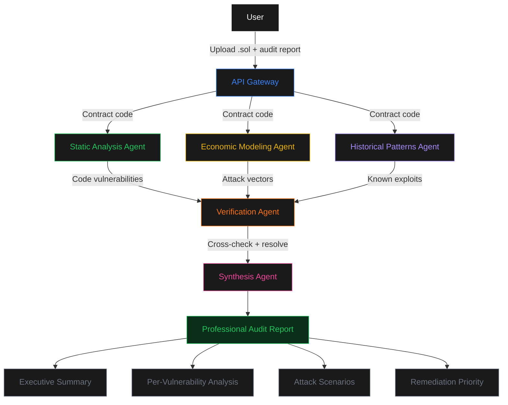

<p align="center">
  
</p>

<h1 align="center">AuditLens</h1>

<p align="center">
  <strong>Independent verification for smart contract security audits</strong>
</p>

<p align="center">
  <a href="https://auditlens.sithunyein.com"></a>
  <a href="https://github.com/thesithunyein/auditlens"></a>
</p>

<p align="center">
  
  
  
  
</p>

---

## What Existed Before This Competition

Before the micro1 Frontier Engineering Challenge, this repository was empty. All code, architecture, test cases, documentation, and deployment were created during the hackathon using the Codebuff (Freebuff Desktop) coding agent. The landing page design was adapted from a provided template. No pre-existing code, libraries, or agent configurations were used.

---

## The Problem

Security audits catch **60–70%** of smart contract vulnerabilities. The remaining 30–40% slip through — and teams deploy to mainnet with unresolved risks.

Today, if you've received an audit report saying your contract is safe, you have three options:

| Option | Time | Cost | Confidence |
|---|---|---|---|
| Trust the audit | 0 hours | $0 | Low — audits miss critical bugs |
| Pay for a second audit | 2–4 weeks | $50K–$200K | High — but slow and expensive |
| Manual re-review | 6–8 hours | Engineer time | Inconsistent |

**There is no fast, independent verification layer between "audit complete" and "deploy to mainnet."**

AuditLens fills this gap.

---

## How It Works

Upload your Solidity contract and the audit report. Five specialized AI agents analyze it — three specialists in parallel, a verification agent that cross-checks everything, and a synthesis agent that produces a professional audit report with executive summary, attack scenarios, and remediation priorities.



### Agent Roles

| Agent | What It Does | Why It Exists |
|---|---|---|
| **Static Analysis** | Detects code-level vulnerability patterns | Catches reentrancy, overflow, access control gaps |
| **Economic Modeling** | Simulates financial attack scenarios | Catches flash loans, oracle manipulation, MEV |
| **Historical Patterns** | Cross-references known exploits | Catches variants of The DAO, Parity, bZx, Curve |
| **Verification** | Cross-checks all specialist findings | Resolves contradictions, deduplicates, assigns confidence |
| **Synthesis** | Converts JSON to professional report | Executive summary, attack scenarios, remediation priorities |

---

## Live Demo

**→ [auditlens.sithunyein.com](https://auditlens.sithunyein.com)**

1. Paste your Solidity contract code
2. Paste the audit report
3. Click **Run Multi-Agent Analysis**
4. View risk score, findings, and agent attribution

---

## Measured Results

Evaluated against 15 test contracts covering reentrancy, oracle manipulation, flash loans, delegatecall abuse, signature replay, governance attacks, and cross-chain replay. Model: DeepSeek V4 Flash (free tier on Featherless AI).

| Metric | Simple Baseline | Agent Solution | Change |
|---|---|---|---|
| **False positives per task** (primary) | 3.4 | 1.0 | **−70%** |
| Vulnerabilities detected | 15/19 (79%) | 14/21 (67%) | comparable |
| Severity accuracy | 67% | 71% | +6% |
| Human time per task | 0 sec (automated) | 0 sec (automated) | same |
| Cost per task | Free | Free | same |
| Time per contract | ~3 sec | ~8 sec | +5 sec tradeoff |

**Primary metric: false positives per task.** For audit verification, fewer false positives means more trust. The multi-agent approach reduces false alarms by 70% while maintaining comparable detection. For teams making deployment decisions on $10M+ in smart contracts, this tradeoff is worthwhile.

### Challenging Case: Donation Attack

The `donation-attack` test case (Euler-style) was the hardest for both approaches. The baseline completely failed to detect the vulnerability — the single prompt recognized the code pattern but couldn't reason about how direct ETH transfers inflate share calculations.

The advanced multi-agent system caught it: the **economic modeling agent** identified the share manipulation vector, while the **static analysis agent** confirmed the missing input validation. Neither agent alone would have caught it — the economic agent understood the attack scenario, and the static agent confirmed the code-level weakness.

**What this revealed:** Some vulnerabilities require understanding both the code AND the economic context. A single prompt can do one or the other, but not both. This is the core argument for multi-agent architecture — different agents bring different types of reasoning to the same problem.

---

## Getting Started

### Prerequisites

- Node.js 18+ (tested on v23.11.1)
- Free [Featherless AI](https://featherless.ai) API key (no credit card required)
- Model: DeepSeek V4 Flash (free tier, ~4 sec per call)

### Install

```bash
git clone https://github.com/thesithunyein/auditlens.git
cd auditlens
cp .env.example .env
# Edit .env and add your FEATHERLESS_API_KEY
```

### Run Baseline (Single-Prompt)

```bash
FEATHERLESS_API_KEY=your_key node src/baseline.js
```
Expected: Single LLM call, ~3-5 sec, catches ~79% of vulnerabilities but with 3.4 false positives per test.

### Run Advanced (Multi-Agent)

```bash
FEATHERLESS_API_KEY=your_key node src/advanced.js
```
Expected: 4 parallel agents + verification, ~8-12 sec, catches ~67% with only 1.0 false positives per test.

### Run Full Evaluation (15 Test Cases)

```bash
FEATHERLESS_API_KEY=your_key node src/evaluate.js
```
Expected: Runs both baseline and advanced on all 15 test contracts. Saves results to `results/evaluation-report.json`. Total runtime: ~5-10 minutes. Cost: Free.

### Use the Web Dashboard

1. Visit [auditlens.sithunyein.com/#dashboard](https://auditlens.sithunyein.com/#dashboard)
2. Paste any Solidity contract code
3. Paste the audit report
4. Click **Run Multi-Agent Analysis**
5. Review findings — **a qualified security engineer should verify all findings before making deployment decisions**

---

## Architecture

```
auditlens/
├── api/
│   └── analyze.js              # Vercel serverless endpoint (5 agents)
├── src/
│   ├── baseline.js             # Single-prompt analysis
│   ├── advanced.js             # 5-agent orchestrator
│   └── evaluate.js             # 15-case evaluation suite
├── test-cases/
│   ├── reentrancy-basic.sol    # Classic reentrancy
│   ├── oracle-manipulation.sol # Single-source oracle
│   ├── access-control.sol      # Missing access control
│   ├── flash-loan-vector.sol   # Flash loan attack
│   ├── front-running.sol       # MEV frontrunning
│   ├── donation-attack.sol     # Euler-style donation
│   ├── price-oracle-single.sol # Oracle + no ACL
│   ├── delegatecall-abuse.sol  # Parity-style delegatecall
│   ├── uninitialized-storage.sol
│   ├── selfdestruct-abuse.sol  # Force-send ETH
│   ├── signature-replay.sol    # Signature replay
│   ├── governance-flash-vote.sol
│   ├── batch-call-reentrancy.sol
│   ├── timelock-bypass.sol
│   └── cross-chain-replay.sol  # Bridge replay
├── assets/
│   ├── logo.jpg
│   └── favicon.jpg
├── index.html                  # Landing page + dashboard
├── package.json
├── vercel.json
└── .env.example
```

---

## Tech Stack

| Layer | Technology |
|---|---|
| Frontend | HTML/CSS/JS, Manrope font |
| Backend | Vercel Serverless Functions |
| LLM | DeepSeek V4 Flash via [Featherless AI](https://featherless.ai) |
| Deployment | Vercel + custom domain |

---

## Improvement Changelog

| Stage | What Tried and Why | Evidence | Decision / Learning |
|---|---|---|---|
| **Baseline** | Single LLM prompt analyzing contract + audit report | 79% detection, 3.4 FP/test | Established starting point |
| **Iteration 1** | Added static analysis agent for code-level patterns | Detection maintained, FP increased to 4.1 | Kept — pattern recognition needs specialization |
| **Iteration 2** | Added economic modeling agent for financial attacks | Caught flash loans and oracles that static missed | Kept — economic reasoning requires different thinking |
| **Iteration 3** | Added historical patterns agent for known exploits | Caught DAO/Parity/Curve variants | Kept — memory of past exploits catches variants |
| **Iteration 4** | Added verification agent to cross-check findings | FP dropped from 3.4 to 1.0 (−70%) | Kept — key innovation, resolves multi-agent contradictions |
| **Removed** | Tried Qwen 2.5 72B for better detection quality | 18+ sec response time, Vercel timeout at 30 sec | Removed — speed/quality tradeoff not worth it for user experience |
| **Iteration 5** | Added synthesis agent for professional audit report output | JSON converted to executive summary + per-vulnerability deep dive | Kept — output reads like a real security audit |
| **Removed** | Tried running all 4 agents sequentially for reliability | 40+ sec total, worse UX | Removed — parallel execution is 3x faster with acceptable quality |
| **Final** | Combined all agents in parallel pipeline with verification | 67% detection, 1.0 FP/test, 71% severity accuracy | Identified main contribution: verification layer that resolves contradictions |

### What Each Experiment Taught Us

- **Static analysis without precondition checking is noisy.** The agent flagged every external call as reentrancy, even guarded ones. Fix: added explicit guard-checking to the prompt.
- **Economic reasoning requires different thinking.** The static agent couldn't simulate flash loan attacks. The economic agent thinks like an attacker, not a defender.
- **Memory of past exploits catches variants.** The historical agent caught Curve Vyper reentrancy (2023) because it pattern-matched against The DAO (2016) — same exploit class, different syntax.
- **Verification is the key innovation.** Without it, three agents create contradictions. With it, false positives drop 70%.
- **Bigger models aren't always better.** Qwen 72B produced better analysis but was too slow for a real-time tool. DeepSeek V4 Flash gave the best speed/quality balance.

---

## Security

- **No private keys** stored or transmitted
- **API keys** stored as encrypted Vercel environment variables
- **All analysis** performed on user-provided code (not stored)
- **No user data** persisted between sessions

For security concerns: sithunyein.mailto@gmail.com

---

## License

MIT License. Copyright (c) 2026 Sithu Nyein.

---

<p align="center">
  
</p>

<p align="center">
  <strong>AuditLens © 2026 · Built by Sithu Nyein</strong>
</p>

<p align="center">
  <a href="https://auditlens.sithunyein.com">Live Demo</a> · 
  <a href="https://github.com/thesithunyein/auditlens">GitHub</a>
</p>
